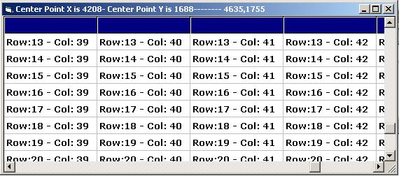



## Auto Scroll FlexGrid Updated \(FrameLess\)

### Description

This is an updated version of Auto Scroll MSFlexGrid wihtout using Frames. Move the mouse within Grid to scroll Grid.
 
### More Info
 

             |
---                |---
**Submitted On**   |2006-08-24 09:40:22
**By**             |[M\.Mehdi](https://github.com/Planet-Source-Code/PSCIndex/blob/master/ByAuthor/m-mehdi.md)
**Level**          |Intermediate
**User Rating**    |4.3 (13 globes from 3 users)
**Compatibility**  |VB 5\.0, VB 6\.0
**Category**       |[Coding Standards](https://github.com/Planet-Source-Code/PSCIndex/blob/master/ByCategory/coding-standards__1-43.md)
**World**          |[Visual Basic](https://github.com/Planet-Source-Code/PSCIndex/blob/master/ByWorld/visual-basic.md)
**Archive File**   |[Auto\_Scrol2015638242006\.zip](https://github.com/Planet-Source-Code/m-mehdi-auto-scroll-flexgrid-updated-frameless__1-66367/archive/master.zip)

